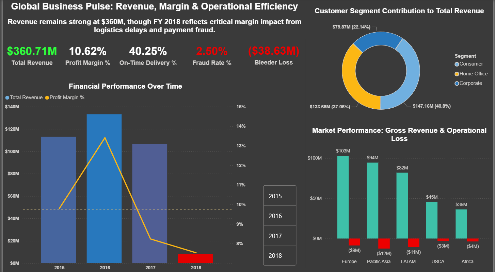
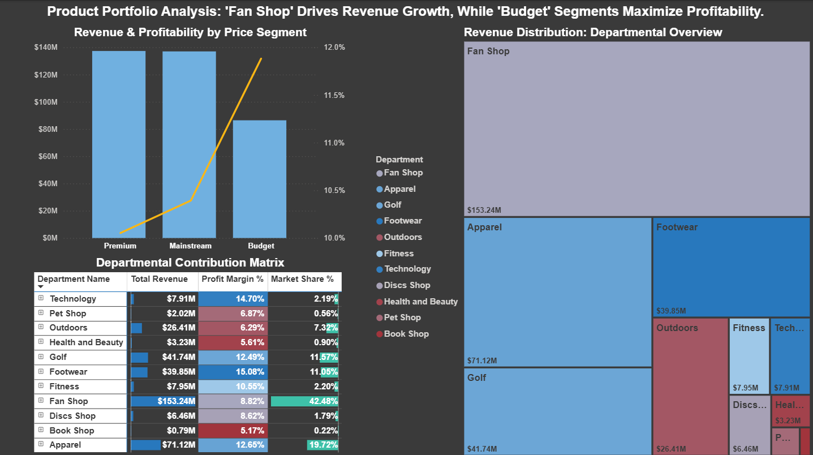
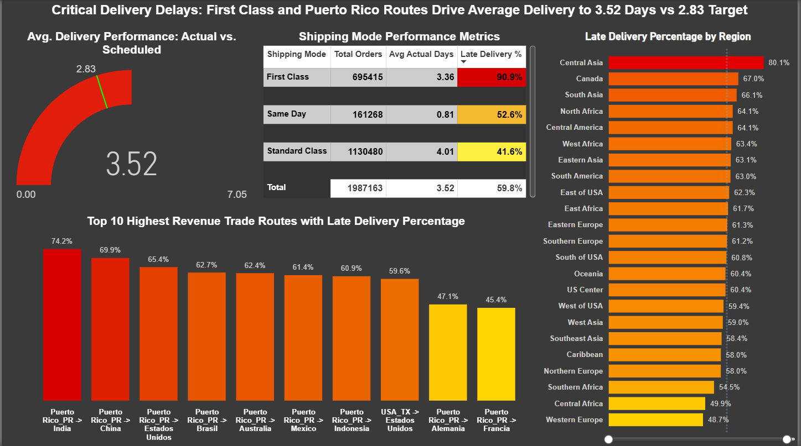
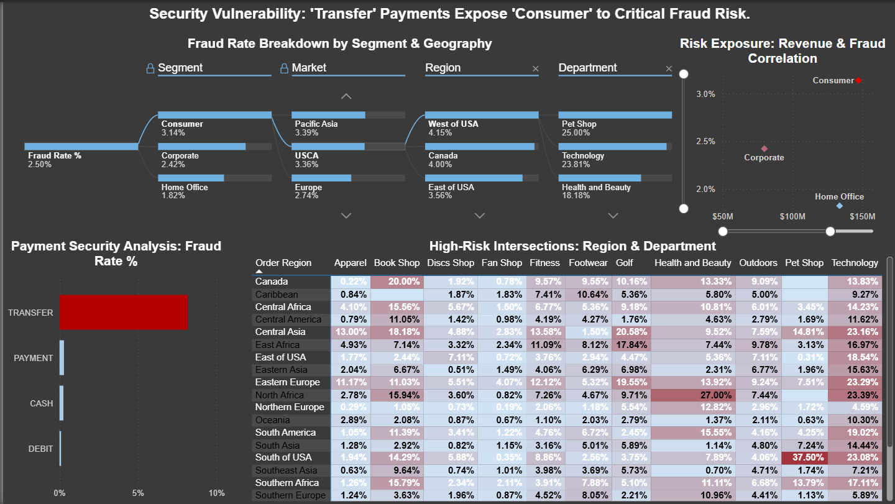
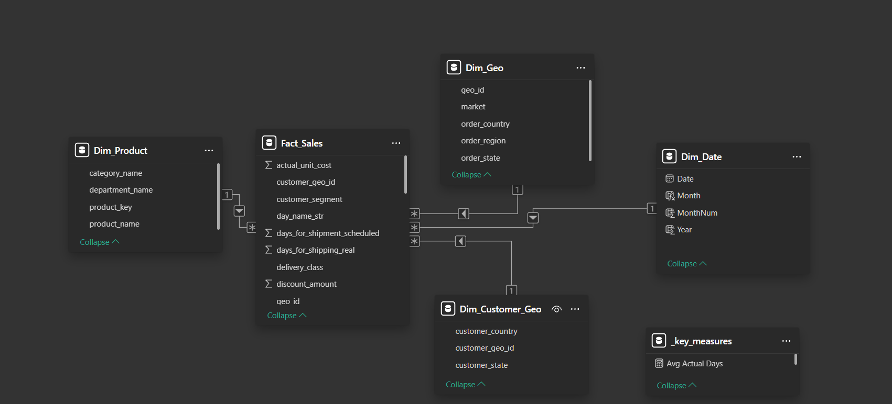

Supply Chain Failure Analysis: Revenue Growth Without Profit

End-to-end analytical case study investigating how operational inefficiencies, logistics failures, and fraud risk caused profit collapse despite strong revenue growth.

---

📌 Project Scope

What this is:

Main Goal:

Diagnose why strong revenue growth failed to translate into profit by identifying operational inefficiencies, logistics failures, and fraud risk across the supply chain.

Tech / Analytical Focus: 

Designed a local Medallion-style analytical workflow with idempotent processing, archival layers, and star-schema modeling, using Microsoft SQL Server as the analytical warehouse for dimensional modeling, PK/FK enforcement, and SQL-driven analysis; supported by SDV (CTGAN)–based synthetic data scaling on Google Colab solely for data generation to stress-test analysis beyond Excel-scale limits.

Intermediate datasets (Fact and Dimension Tables) were stored in Parquet format to support columnar analytics and efficient downstream processing.

What this is NOT:

Not a Predictive ML Project: SDV (Synthetic Data Vault) was used strictly for data upscaling to stress-test the SQL logic.

Not a Production ETL Pipeline: This is an analytical workflow focused on business insights, not real-time data engineering.

---

📊 The Dashboard

A four-page analytical case study showing how strong revenue growth from 2015–2017 masked operational and risk failures, culminating in a sharp business collapse in 2018.

## The Dashboards

Fig. 1: Identifies strong revenue masking margin collapse driven by logistics delays and fraud.

Fig. 2: Reveals revenue concentration in Fan Shop while profitability is driven by Budget segments.

Fig. 3: Pinpoints First Class shipping and Puerto Rico routes as primary delivery delay drivers.

Fig. 4: Exposes transfer payments in Consumer segments as the dominant fraud vector.

## Data Model & Semantic Layer

Fig. 5: Power BI data model supporting analytical queries (Star Schema).

---

🛠 Workflow & Architecture

1. Raw Data Preparation (Python)

- Ingested the original DataCo supply chain dataset from Kaggle and performed extensive cleaning  to resolve encoding issues, inconsistent text values, invalid dates, and schema inconsistencies.

- Prepared a normalized, model-ready dataset suitable for synthetic data generation.

2. Synthetic Data Scaling (SDV on Google Colab)

- Trained an SDV (CTGAN) model on the cleaned dataset using Google Colab (Free Tier) due to local compute constraints.

- Generated ~2 million synthetic rows to enable stress-testing of analytical logic beyond Excel-scale limitations while preserving key data relationships.

3. Bronze → Silver Processing (Local Pipelines)

- Implemented local Bronze-to-Silver pipelines to standardize schemas, enforce data types, and apply calculated fields.

- Designed both single-file and batch-processing workflows with idempotent execution and archival handling to ensure reproducibility and safe re-runs.

4. Analytical Data Modeling (SQL Server)

- Created a relational analytical database in Microsoft SQL Server.

- Modeled fact and dimension tables using a star schema and enforced primary and foreign key relationships to support analytical queries.

5. Silver → SQL Loading Pipeline

- Developed a dedicated pipeline to load curated Silver-layer data into SQL Server tables, ensuring referential integrity and consistent analytical state.

6. BI Consumption & Analytical Measures (Power BI, Import Mode)

- Imported the modeled SQL data into Power BI using Import mode for stable performance and consistent metric evaluation.

- Created analytical DAX measures (stored in a dedicated "_key_measures" layer) to calculate KPIs, performance indicators, and risk metrics used across dashboards.

---

❓ Business Questions Solved

1. Why did the business collapse in 2018 despite strong revenue growth from 2015–2017?
→ Revenue growth masked margin erosion caused by logistics delays and fraud-related losses, which compounded over time and led to a sharp collapse.

2. Which products and price segments drive revenue versus profitability?
→ Fan Shop dominates revenue, while Budget segments contribute disproportionately to profitability, revealing a volume–margin mismatch.

3. Where are operational failures most concentrated?
→ First Class shipping and Puerto Rico outbound routes account for the majority of late deliveries and delivery-time overruns.

4. Which customer and payment combinations present the highest fraud risk?
→ Fraud is highly concentrated in Consumer segments using transfer payments, indicating a process failure rather than broad-based risk.

Supporting Analytical Definitions:
To enable consistent and decision-ready analysis, several derived metrics and categorical definitions were implemented during the Bronze → Silver data preparation stage.

1. Financial & Profitability Foundations
- Established core financial metrics (gross sales, net revenue, discounts, and implicit total cost) to define a reliable profit-and-loss baseline at the order level.

- Enabled identification of margin erosion, pricing inefficiencies, and loss-making (“profit bleeder”) orders that were not directly visible in the raw dataset.

2. Operational & Efficiency Metrics
- Derived unit-level cost, markup, margin leakage, and logistics delay indicators to uncover procurement drift, pricing power failures, and delivery inefficiencies.

- Introduced delivery performance deltas and binary loss flags to isolate operational failures without relying on misleading averages.

3. Strategic Segmentation & Classification
- Created categorical groupings for delivery performance, price segments, order timing, and trade routes to translate raw transactional data into business-relevant segments.

- These segments enabled focused analysis of portfolio strategy, supply chain bottlenecks, and risk concentration across regions and customer types.

---

📂 Repository Structure

/data_scaling: Google Colab notebooks used for SDV (CTGAN) training and synthetic data generation to scale the dataset beyond Excel-sized limits.

/pipelines: Local Bronze → Silver and Silver → SQL processing scripts implementing idempotent, reproducible data preparation workflows.

/sql: DDLs and analytical queries.

/powerbi: The .pbix dashboard file.

/docs: Additional reference material.

---

⚙️ Tech Stack & Decisions

Microsoft SQL Server: Used as the analytical warehouse for schema enforcement, PK/FK relationships, and SQL-driven analysis; dimensional shaping handled upstream.

Power BI: Used for analytical consumption and storytelling; DAX measures organized in a dedicated "_key_measures" layer for KPIs and risk metrics.

Python (Pandas / Polars): Used for raw data cleaning, normalization, and Bronze → Silver processing with idempotent and archival logic.

SDV (CTGAN) + Google Colab: Used exclusively for synthetic data generation (~2M rows) to stress-test analytical logic beyond Excel-scale limits

Note: Google Colab was used solely for SDV (CTGAN) training due to the absence of local GPU resources.

---

⚠️ Limitations

- Customer-level identifiers and personal attributes were intentionally excluded during synthetic data generation to ensure model stability and scalability, focusing the analysis on aggregate supply chain, operational, and financial behavior rather than individual customers.

- Cost, profit, and logistics metrics are derived from available columns and represent analytical estimates rather than audited financial figures.

- The workflow is designed for analytical correctness and reproducibility, not real-time processing or production-scale orchestration.

---

Note:
- Additional exploratory scripts were used during validation and experimentation
  but are intentionally excluded to keep the repository focused and reproducible.

- Trained model artifacts (.pkl) are intentionally excluded to keep the repository lightweight and reproducible.