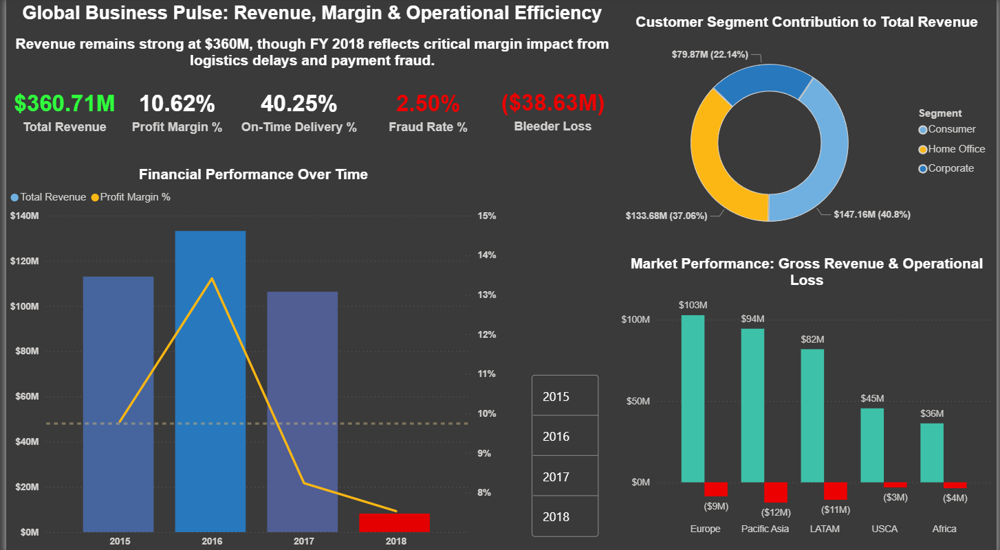
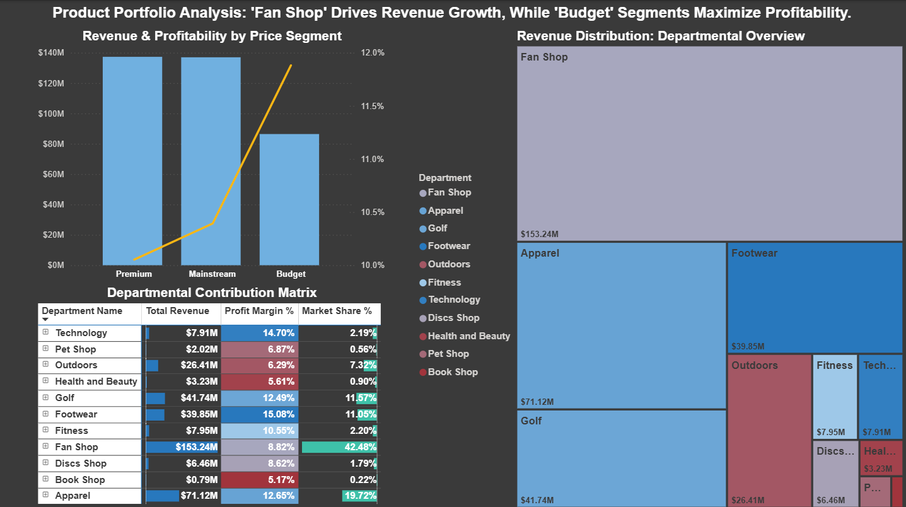
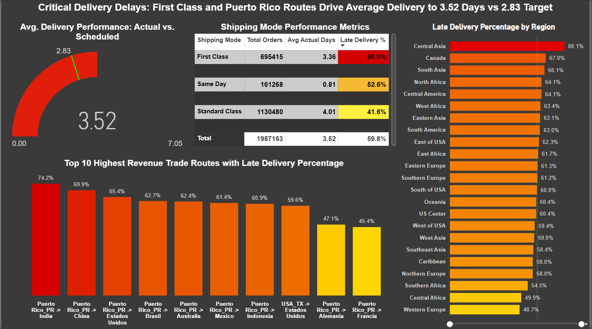
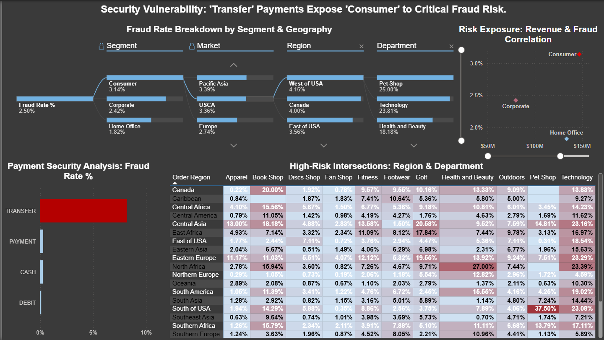

# Supply Chain Failure Analysis: Revenue Growth Without Profit

> **An end-to-end analytical data engineering and BI case study investigating how operational inefficiencies, logistics failures, and fraud risk caused profit collapse despite strong revenue growth.**


---

## 📌 Project Scope

### What this is
Diagnose why strong revenue growth failed to translate into profit by identifying operational inefficiencies, logistics failures, and fraud risk across the supply chain.

### Technical & Architectural Focus
This project showcases a **modern, enterprise-grade data engineering workflow running entirely locally**. It implements a strict **Medallion Architecture (Bronze → Silver → Gold/SQL)** powered by a local **MinIO S3 Object Store**.

- **Idempotent pipelines** stream data from S3 using `s3fs` and `polars`.
- **Microsoft SQL Server** acts as the serving layer for dimensional star-schema modeling and SQL-driven analysis.
- **SDV (CTGAN)** on Google Colab was used to synthesize 2 million rows of transaction data to stress-test the SQL logic beyond standard Excel-scale limits.

### What this is NOT
- **Not a Predictive ML Project:** SDV was used strictly for data upscaling to stress-test the SQL logic, not for predictive modeling.
- **Not a Production Orchestration Demo:** This is an analytical workflow focused on business insights and data structuring, rather than Airflow/Dagster scheduling.

---

## 🛠 Workflow & Architecture

### 1. The MinIO (Local S3) Data Lake
We moved away from brittle, hardcoded local file paths and implemented a true object storage data lake using **MinIO**. A centralized `config.py` manages S3 endpoints, buckets (`s3://data-lake/bronze`, `s3://data-lake/silver`), and credentials.

### 2. Raw Data & Synthetic Scaling (Colab)
- Cleaned the original Kaggle DataCo dataset to resolve severe encoding issues and schema drift.
- Trained an SDV (CTGAN) model to generate ~2 million synthetic rows, bypassing local compute constraints to stress-test the pipeline.

### 3. Bronze → Silver Processing (Polars + S3)
- Implemented extremely fast, strictly DRY pipelines using `polars` that read directly from the S3 Bronze bucket.
- Transforms derive highly-specific business metrics (e.g., `margin_leakage_pct`, `is_profit_bleeder`).
- Writes fully relational, columnar `.parquet` files to the Silver S3 bucket, whilst archiving processed source files for idempotency.

### 4. Silver → SQL Serving Pipeline
- Extracts curated Silver data from S3 and bulks-loads it into SQL Server using SQLAlchemy (`fast_executemany` enabled for massive performance gains).
- **TEST_MODE:** Built-in support to seamlessly swap MS SQL Server for a local SQLite database, allowing end-to-end CI/CD testing without needing external database infrastructure.

---

## 📊 Analytical Insights & Dashboards

A four-page analytical case study showing how strong revenue growth from 2015–2017 masked operational and risk failures, culminating in a sharp business collapse in 2018.

| Executive Overview | Product & Portfolio Analysis |
|:---:|:---:|
|  |  |
| *Identifies strong revenue masking margin collapse driven by logistics delays and fraud.* | *Reveals revenue concentration in Fan Shop while profitability is driven by Budget segments.* |

| Operational Performance | Fraud & Risk Exposure |
|:---:|:---:|
|  |  |
| *Pinpoints First Class shipping and Puerto Rico routes as primary delivery delay drivers.* | *Exposes transfer payments in Consumer segments as the dominant fraud vector.* |

---

## 📂 Repository Structure

```text
├── config.py             # Central MinIO S3 object store and SQL database config
├── data_scaling/         # Google Colab notebooks for CTGAN synthetic generation
├── docs/                 # Dimension setup and architectural docs
├── pipelines/            # Bronze → Silver (Polars) and Silver → SQL (S3fs) scripts
│   ├── transformations.py           # Core DRY Polars logic
│   ├── Project_Batch_Process.py     # Main Medallion S3 batch processor
│   └── Project_Single_File_Redundant.py # Maintained for legacy reference
├── powerbi/              # The .pbix dashboard file and DAX measures
└── sql/                  # DDLs and analytical queries for SQL Server
```

---

## ⚙️ Tech Stack

- **Data Lake:** MinIO (Local S3 Object Store), `s3fs`
- **Data Engineering:** Python, Polars, Pandas
- **Serving Layer:** Microsoft SQL Server (or SQLite in `TEST_MODE`), SQLAlchemy
- **Analytics & BI:** Power BI, DAX
- **Synthetic Data:** SDV (CTGAN), PyTorch
